# ☁️ Cloud Security Operations & Infrastructure Hardening Portfolio

> Designed, deployed, secured, and documented an AWS cloud environment using security best practices. This portfolio demonstrates hands-on experience with infrastructure hardening, secure remote administration, network segmentation, access control, monitoring, and incident-ready logging.

---

# Architecture Overview

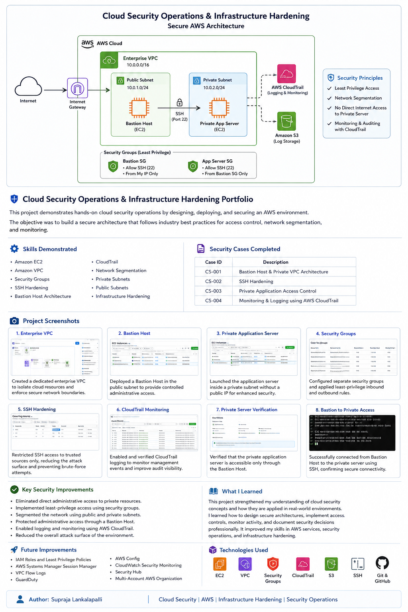

---

# Project Summary

This project simulates a production-inspired AWS environment where security is built into every layer of the infrastructure.

The objective was not simply to launch EC2 instances, but to design a secure environment that follows cloud security principles including:

- Defense in Depth
- Least Privilege
- Network Segmentation
- Secure Administrative Access
- Infrastructure Hardening
- Continuous Monitoring
- Audit Logging

The environment was implemented entirely within AWS using Free Tier eligible services wherever possible.

---

# AWS Services Used

- Amazon EC2
- Amazon VPC
- Internet Gateway
- Public & Private Subnets
- Route Tables
- Security Groups
- AWS CloudTrail
- IAM
- SSH Key Pairs

---

# Environment Overview

### AWS Environment

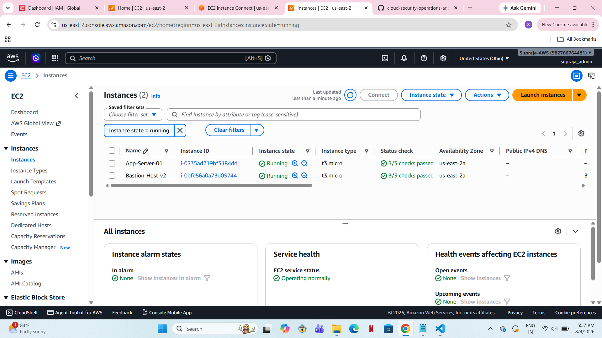

This screenshot shows the completed AWS environment after deployment.

Resources include:

- Enterprise VPC
- Public Subnet
- Private Subnet
- Bastion Host
- Private Application Server
- Security Groups
- CloudTrail Logging

---

# Security Case Studies

---

## CS-001 — Enterprise VPC & Bastion Host Deployment

### Objective

Build a secure enterprise network where administrative access is isolated through a Bastion Host instead of exposing production servers directly to the Internet.

### Implemented

- Created Enterprise VPC
- Configured Public and Private Subnets
- Attached Internet Gateway
- Configured Route Tables
- Deployed Bastion Host in Public Subnet
- Assigned Elastic/Public IP only to Bastion Host

### Evidence

#### Enterprise VPC

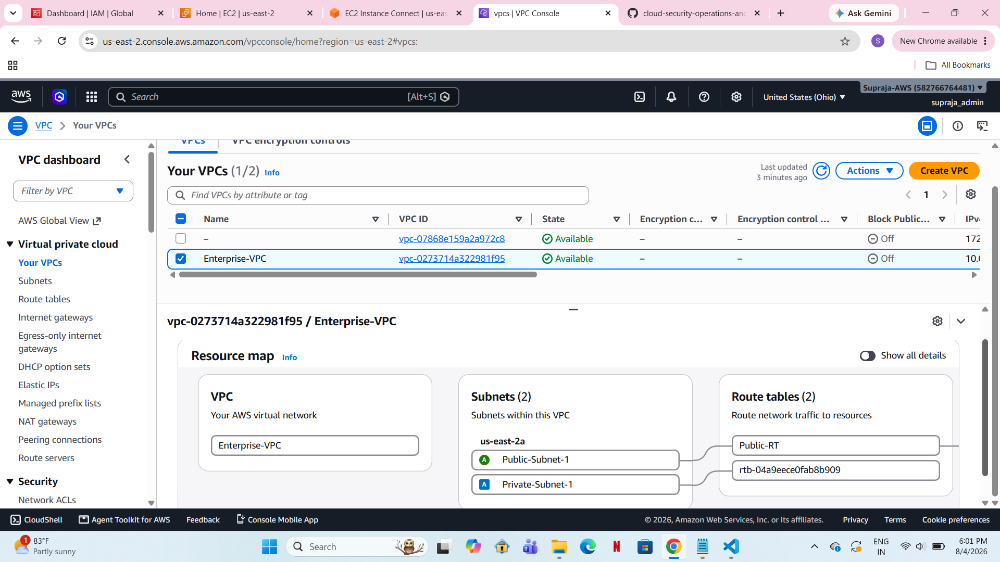

#### Bastion Host

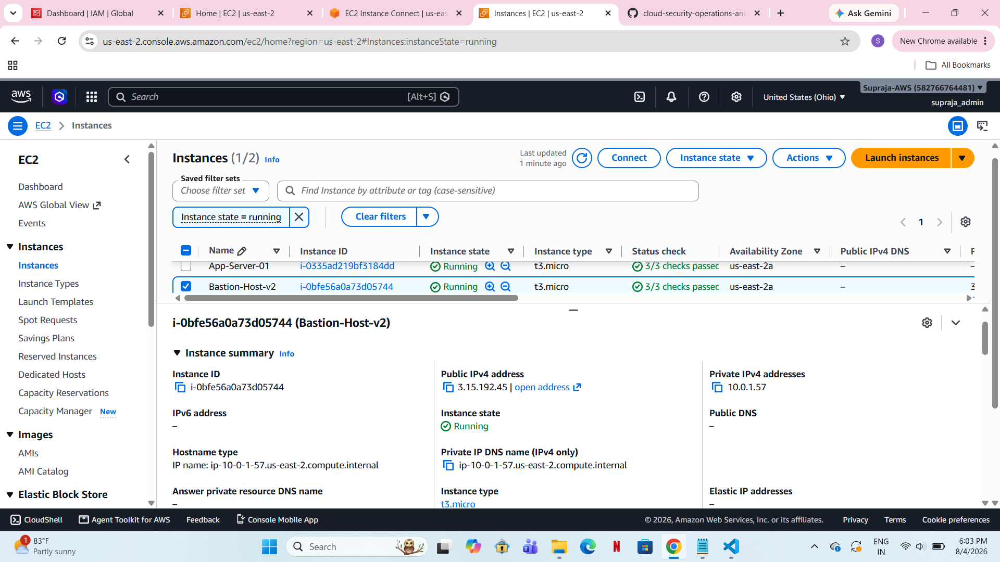

#### Bastion Host Details

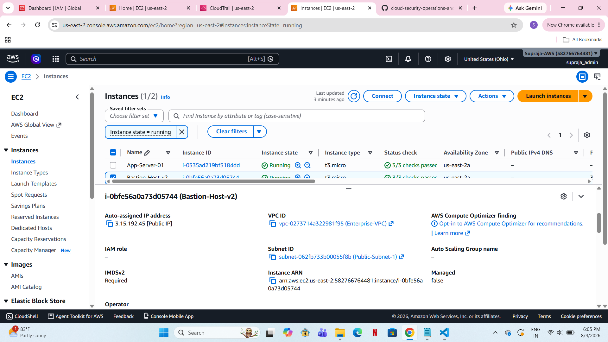

---

## CS-002 — SSH Hardening

### Objective

Secure administrative SSH access by limiting inbound connections and eliminating unnecessary exposure.

### Security Improvements

- SSH restricted to administrator IP
- Removed unrestricted SSH access
- Enforced least privilege access
- Hardened Security Group rules
- Bastion Host acts as the only administrative entry point

### Evidence

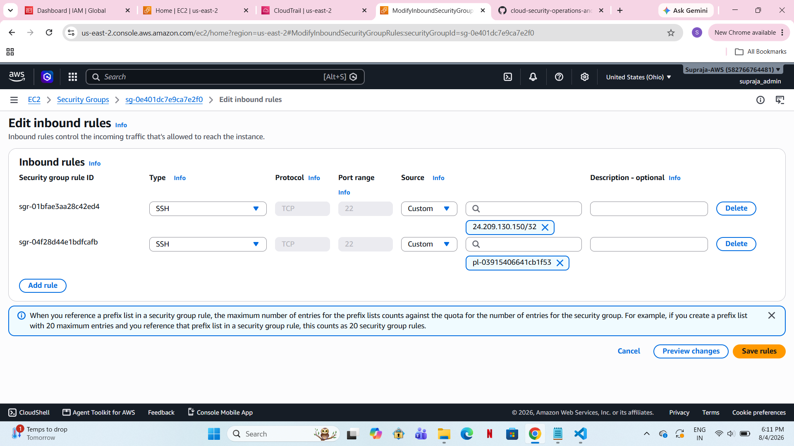

---

## CS-003 — Private Application Server

### Objective

Deploy an application server that is completely isolated from the public Internet.

### Security Controls

- Private EC2 instance
- No Public IP
- Private Subnet deployment
- Accessible only through Bastion Host
- Internal VPC communication only

### Evidence

#### Private Application Server

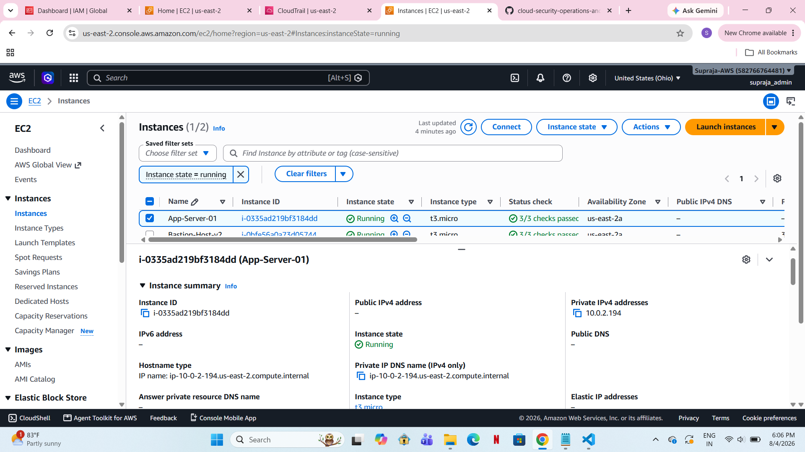

#### Instance Details

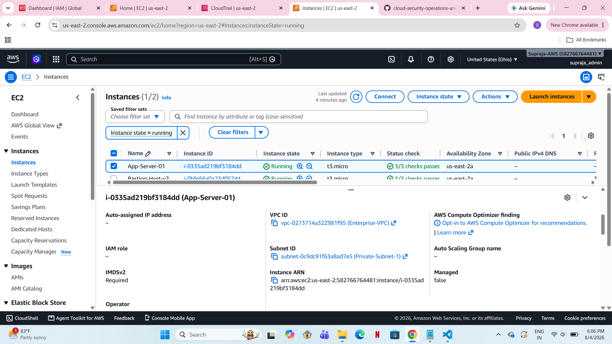

---

## CS-004 — Security Groups & Network Segmentation

### Objective

Implement network-level security using AWS Security Groups.

### Configured Rules

Bastion Host Security Group

- Allow SSH (22) from administrator IP
- Deny all unnecessary inbound traffic

Private Application Security Group

- Allow SSH only from Bastion Host Security Group
- No Internet exposure
- Default deny for all other inbound traffic

### Evidence

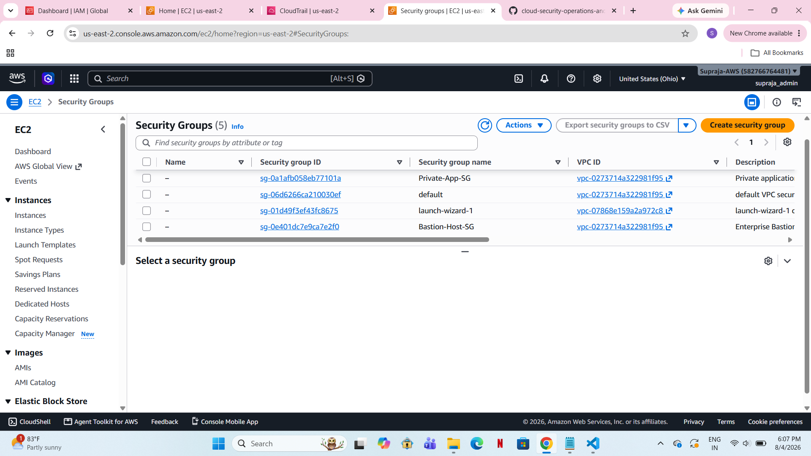

---

## CS-005 — Monitoring & Logging

### Objective

Enable audit logging to improve visibility into infrastructure activity.

### Implemented

- AWS CloudTrail
- Event History monitoring
- Login tracking
- Instance activity logging
- Security event auditing

### Evidence

#### CloudTrail

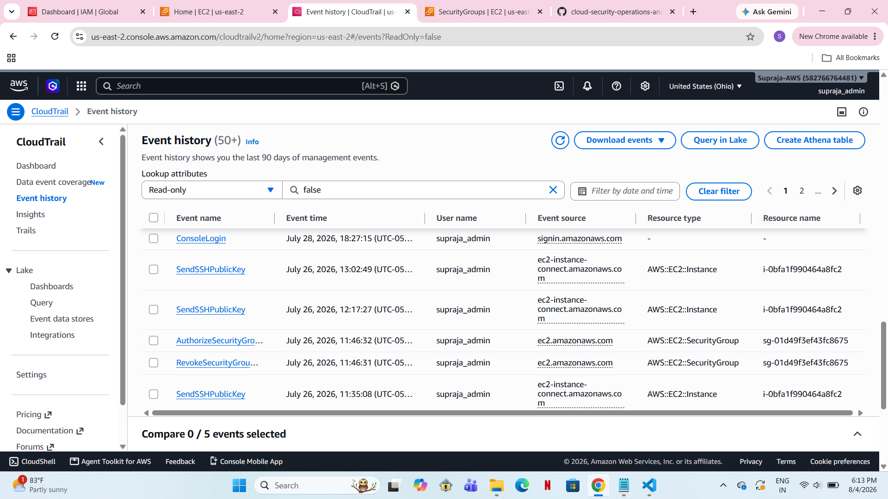

#### Event Logs

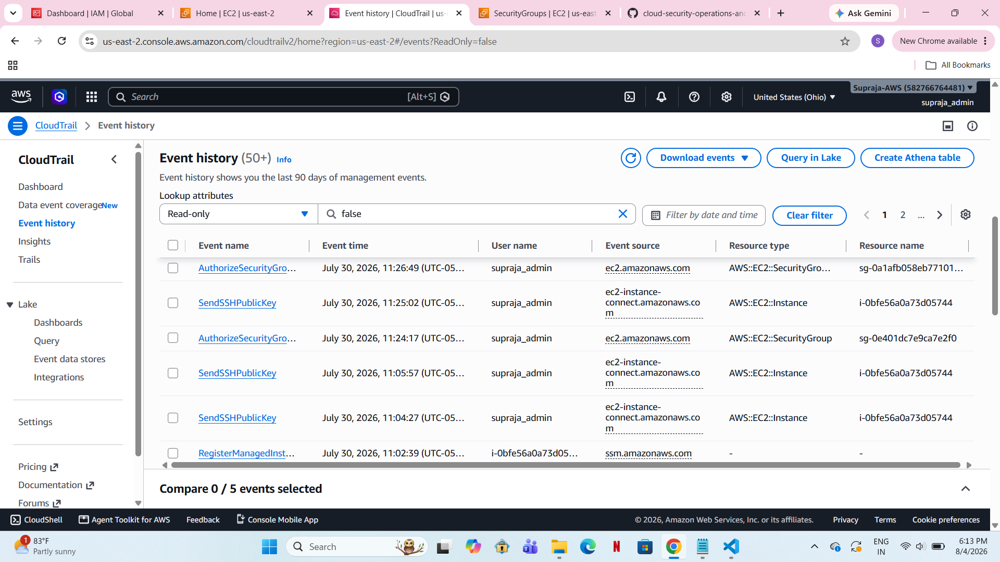

---

# Security Principles Demonstrated

- Defense in Depth
- Zero Trust Mindset
- Least Privilege
- Secure Remote Administration
- Private Infrastructure Design
- Network Segmentation
- Infrastructure Hardening
- Security Monitoring
- Cloud Audit Logging

---

# Skills Demonstrated

### Cloud Platforms

- AWS

### Compute

- Amazon EC2

### Networking

- Amazon VPC
- Public & Private Subnets
- Route Tables
- Internet Gateway

### Security

- Security Groups
- SSH Hardening
- Bastion Host Architecture
- Network Isolation
- Least Privilege
- Defense in Depth

### Monitoring

- AWS CloudTrail

### Documentation

- Security Case Documentation
- Infrastructure Diagrams
- Technical Reporting
- GitHub Portfolio Development

---

# What I Learned

Through this project I gained practical experience designing and securing AWS infrastructure using real-world cloud security concepts.

Rather than simply deploying cloud resources, I focused on building an environment that demonstrates secure architecture, controlled administrative access, network segmentation, infrastructure hardening, and continuous monitoring.

This project strengthened my understanding of how cloud engineers and security engineers collaborate to design secure, scalable, and auditable cloud environments.

---

# Future Improvements

Planned enhancements include:

- IAM Role Based Access Control
- AWS Systems Manager Session Manager
- AWS Config
- GuardDuty
- AWS Security Hub
- VPC Flow Logs
- CloudWatch Monitoring
- AWS WAF
- Network ACL Hardening
- Automated Security Compliance Checks

---

# Repository Structure

```
cloud-security-operations-and-infrastructure-hardening/
│
├── screenshots/
├── security-cases/
│
├── README.md
└── PORTFOLIO.md
```

---

# Author

**Supraja Lankalapalli**

Aspiring Cloud Security Engineer

Focused on AWS Security, Cloud Infrastructure, Infrastructure Hardening, IAM, Networking, and Security Operations.

GitHub:
https://github.com/supraja-lankalapalli

---
